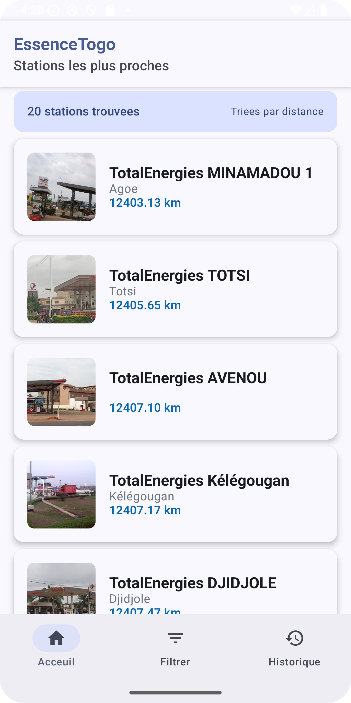
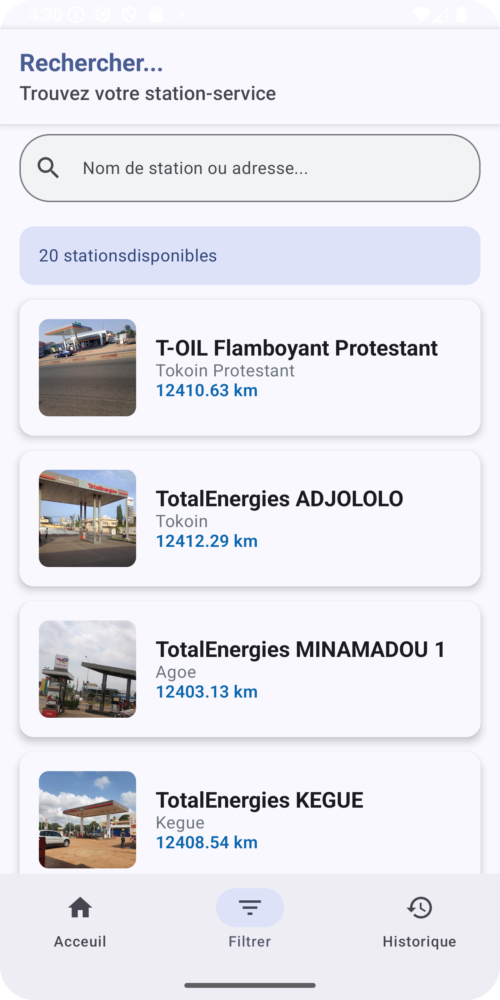
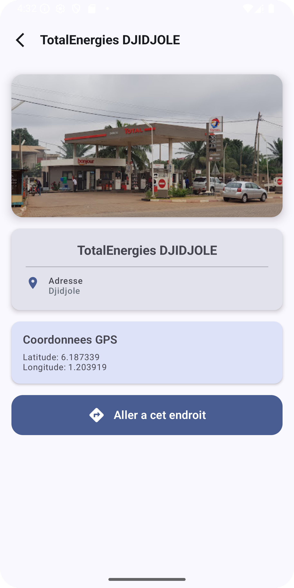
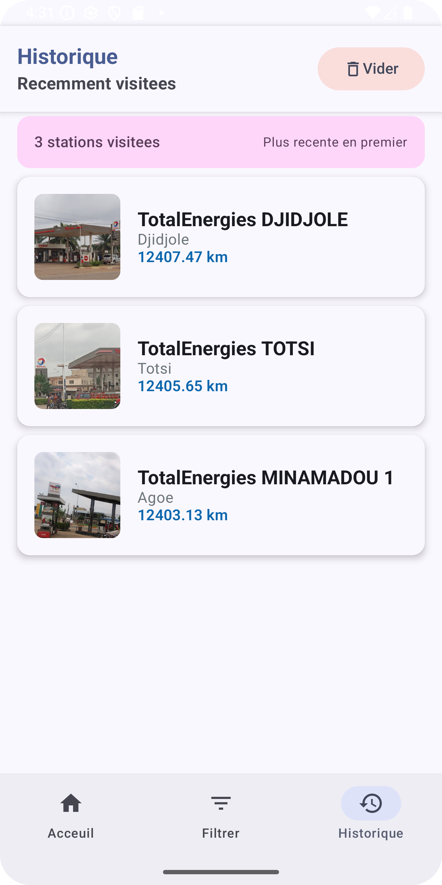

# Essence Togo 🛣️⛽

Une application mobile Android moderne pour localiser les stations-service au Togo, développée avec Jetpack Compose et Firebase.

## 📱 Fonctionnalités

- **🗺️ Localisation des stations** : Trouvez les stations-service les plus proches de votre position
- **📍 Géolocalisation** : Calcul automatique des distances avec votre position actuelle
- **🔍 Recherche avancée** : Recherchez par nom de station ou adresse
- **📋 Historique** : Consultez vos dernières stations visitées
- **🎨 Interface moderne** : Design moderne avec Material Design 3
- **⚡ Temps réel** : Données synchronisées en temps réel avec Firebase

## 🏗️ Architecture

L'application suit une architecture MVVM (Model-View-ViewModel) avec les composants suivants :

### 📂 Structure du projet

```
app/src/main/java/com/example/essence_togo/
├── data/
│   ├── local/
│   │   └── PreferencesManager.kt          # Gestion des préférences locales
│   ├── model/
│   │   └── Station.kt                     # Modèle de données des stations
│   └── repository/
│       └── StationRepository.kt           # Couche d'accès aux données
├── presentation/
│   └── ui/
│       ├── navigation/                    # Navigation de l'app
│       └── theme/                         # Thème Material Design
├── utils/
│   └── LocationManager.kt                 # Gestionnaire de géolocalisation
└── MainActivity.kt                        # Activité principale
```

### 🛠️ Technologies utilisées

- **Kotlin** - Langage de programmation principal
- **Jetpack Compose** - Interface utilisateur moderne et déclarative
- **Firebase Realtime Database** - Base de données en temps réel
- **Material Design 3** - Design system moderne de Google
- **Navigation Compose** - Navigation entre les écrans
- **Coroutines & Flow** - Programmation asynchrone et réactive
- **Location Services** - Services de géolocalisation Android

## 📷 Captures d'écran

### Écran d'accueil

*Vue principale avec la liste des stations proches*

### Recherche de stations

*Fonctionnalité de recherche par nom ou adresse*

### Détails d'une station

*Informations détaillées d'une station avec navigation*

### Historique

*Liste des stations récemment visitées*

## 🚀 Installation et Configuration

### Prérequis
- Android Studio Arctic Fox (2021.3.1) ou plus récent
- JDK 8 ou plus récent
- SDK Android 21+ (Android 5.0)
- Compte Firebase avec projet configuré

### 1. Clonage du projet
```bash
git clone https://github.com/votre-username/essence-togo.git
cd essence-togo
```

### 2. Configuration Firebase
1. Créez un nouveau projet sur [Firebase Console](https://console.firebase.google.com/)
2. Activez **Realtime Database**
3. Téléchargez le fichier `google-services.json`
4. Placez-le dans le dossier `app/`

### 3. Structure de la base de données Firebase
```json
{
  "stations": {
    "station_1": {
      "id": 1,
      "nom": "Total Station Centre",
      "address": "Avenue du 24 Janvier, Lomé",
      "latitude": 6.1319,
      "longitude": 1.2228,
      "imageUrl": "https://example.com/image.jpg"
    },
    "station_2": {
      "id": 2,
      "nom": "Shell Station Tokoin",
      "address": "Quartier Tokoin, Lomé",
      "latitude": 6.1375,
      "longitude": 1.2123,
      "imageUrl": "https://example.com/image2.jpg"
    }
  }
}
```

### 4. Permissions
L'application requiert les permissions suivantes (déjà configurées dans le manifest) :
- `ACCESS_FINE_LOCATION` - Localisation précise
- `ACCESS_COARSE_LOCATION` - Localisation approximative
- `INTERNET` - Connexion internet
- `ACCESS_NETWORK_STATE` - État du réseau

## 🔧 Utilisation

1. **Premier lancement** : L'app demande les permissions de localisation
2. **Navigation** : Utilisez la barre de navigation en bas pour naviguer
3. **Recherche** : Tapez dans la barre de recherche pour filtrer les stations
4. **Détails** : Touchez une station pour voir ses détails et naviguer
5. **Navigation** : Touchez le bouton de navigation pour ouvrir Google Maps

## 📊 Fonctionnalités techniques

### Calcul de distance
L'application utilise la formule de Haversine pour calculer la distance entre votre position et les stations :

```kotlin
fun calculateDistance(userLat: Double, userLong: Double): Double {
    val earthRadius = 6371.0 // Rayon de la Terre en km
    // ... calcul Haversine
}
```

### Gestion de l'état
- **StateFlow** pour les données réactives
- **SharedPreferences** pour la persistance locale
- **Firebase Realtime Database** pour les données temps réel

### Performance
- Mise en cache des stations visitées
- Limitation de l'historique à 50 stations maximum
- Calcul de distance optimisé

---

Made with ❤️ pour la communauté togolaise
